# Deliberative Consensus Workflow

## Basic Setting

Read the `config.json` file to understand the basic settings.

## Core Principle

> Consensus is not aggregation; consensus is adversarially tested survival.

Do NOT skip any stage. Do NOT produce a ruling without cross-examination. The value of this workflow is in the structured conflict, not the final answer.

## State Machine

```dot
digraph DeliberativeConsensusWorkflow {
  rankdir=LR;
  node [shape=box, style="rounded"];

  START [shape=circle, label="START"];
  END [shape=doublecircle, label="END"];

  FRAMING [label="Stage 0\nTask Framing"];
  STANCE_COLLECTION [label="Stage 1\nIndependent Stance Generation"];
  CROSS_EXAM [label="Stage 2\nCross-Examination"];
  BELIEF_REVISION [label="Stage 3\nBelief Revision"];
  EVIDENCE_GAP_CHECK [label="Evidence Gap Check"];
  ARBITRATION [label="Stage 4\nArbitration & Dossier"];

  ABORT_INSUFFICIENT_AGENTS [label="Abort:\n< 2 valid stance agents"];
  ABORT_INSUFFICIENT_EVIDENCE [label="Fallback:\nInvestigate / Need More Evidence"];

  START -> FRAMING;
  FRAMING -> STANCE_COLLECTION [label="problem_statement + evaluation_axes ready"];

  STANCE_COLLECTION -> ABORT_INSUFFICIENT_AGENTS [label="< 2 agents succeeded"];
  STANCE_COLLECTION -> CROSS_EXAM [label=">= 2 stance outputs ready"];

  CROSS_EXAM -> BELIEF_REVISION [label="cross-attacks collected"];

  BELIEF_REVISION -> EVIDENCE_GAP_CHECK [label="revisions submitted"];

  EVIDENCE_GAP_CHECK -> CROSS_EXAM [label="≥1 RESOLVABLE gap\nAND max_rounds not reached"];
  EVIDENCE_GAP_CHECK -> ARBITRATION [label="all gaps EXTERNAL\nOR max_rounds reached"];
  EVIDENCE_GAP_CHECK -> ABORT_INSUFFICIENT_EVIDENCE [label="any CRITICAL-MISSING gap"];

  ARBITRATION -> END [label="ruling + minority report + next actions ready"];

  ABORT_INSUFFICIENT_AGENTS -> END;
  ABORT_INSUFFICIENT_EVIDENCE -> END;
}
```



You MUST follow this state machine. No skipping stages. No jumping to conclusions.

## Sub Agents

Defined in `config.json` under `agents`. Default:
- Critics: `analytical-critic`, `risk-critic`, `pragmatic-critic`
- Arbiter: `arbiter`

## How to Spawn Sub Agents

Agents defined in `.claude/agents/` are auto-discovered at session startup. Invoke them directly:

```
Agent(subagent_type: "{agent-name}", model: "{config.sub_agent_model}", prompt: "...")
```

The system automatically injects the agent's role definition. Do NOT read or embed agent files manually.

## Templates & Scripts

- Schema references: `templates/`
- Timestamp: run `bash ./scripts/timestamp.sh` to get accurate ISO 8601 timestamps
- Validation: run `bash ./scripts/validate-artifact.sh <stage> <file>` after each stage to verify artifacts

---

## Stage 0 — Task Framing

**Actor:** You (Coordinator / main session)

**Steps:**
1. Generate a `decision_id` in format `{config.decision_id_format}-<short-slug>` (e.g., `20260329-143022-review-auth-middleware`)
2. Create the output directory: `mkdir -p {config.output_dir}/{decision_id}`
3. Get timestamp: `bash ./scripts/timestamp.sh`
4. Analyze the user's request and relevant codebase to formulate the problem
5. Write `stage0-framing.md` to `{config.output_dir}/{decision_id}/stage0-framing.md`
   - Follow the schema in `templates/stage0-framing.md`
   - Include: problem statement, evaluation axes, evidence scope, context
6. Announce to the user: "Stage 0 complete. Framing written to {path}. Proceeding to stance generation."

---

## Stage 1 — Stance Generation

**Actor:** 3 critic agents in parallel

**Steps:**
1. Spawn ALL THREE critic agents simultaneously using parallel Agent tool calls:
   - `Agent(subagent_type: "analytical-critic", model: "{config.sub_agent_model}")`
   - `Agent(subagent_type: "risk-critic", model: "{config.sub_agent_model}")`
   - `Agent(subagent_type: "pragmatic-critic", model: "{config.sub_agent_model}")`

   Each agent's prompt:
   ```
   You are executing Stage 1 (Stance Generation) of a deliberative consensus workflow.

   DECISION ID: {decision_id}

   Read EXACTLY these files, in this order:
   1. {config.output_dir}/{decision_id}/stage0-framing.md
   2. {primary document path from framing}
   3. {supporting document paths from framing, if any}
   4. .claude/skills/deliberate-consensus/templates/stage1-stance.md

   Get your timestamp by running EXACTLY this command: bash .claude/skills/deliberate-consensus/scripts/timestamp.sh
   Do NOT use absolute paths. The working directory is already the project root.

   Write your stance to:
   {config.output_dir}/{decision_id}/stage1-{agent-name}.md

   IMPORTANT:
   - Form your stance INDEPENDENTLY — do not look for other critics' outputs
   - Every critical claim must cite evidence (file:line or command output)
   - Mark unsupported claims as [HYPOTHESIS]. Maximum 2 out of 5 findings may be [HYPOTHESIS]-based. The remaining ≥ 3 must have verified evidence cites.
   - Keep total output under 150 lines. Be precise, not exhaustive.
   - Maximum 5 key findings, 3 assumptions. No extra sections.
   - CRITICAL THINKING DISCIPLINE — Before forming your recommendation, apply these filters:
     1. Ask: "What answer does this document WANT me to give?" That answer is the trap. Avoid it.
     2. Before asking "how to improve this," ask: "Is the problem definition itself correct? Who framed it, and what did the framing exclude?"
     3. Silent correctness is more dangerous than visible failure. A system that never crashes just hasn't shown you where it's wrong. Look for what's quietly assumed to be fine.
     4. If your recommendation feels comfortable and safe — stop. Something is wrong. `revise` is often the comfortable middle ground that challenges nothing.
     5. Do NOT describe what you want. Describe the boundaries of what you reject. Let your recommendation emerge from what survives elimination.
     Consider the FULL range: accept, reject, revise, investigate. Commit to the one your evidence best supports AFTER elimination, not the one that feels safest.
   - STRICT FILE SCOPE: Read ONLY the files listed above. Do NOT use Glob, Grep, or any search tools. Do NOT read any other files in the repository. Your evidence must come exclusively from the documents provided. If you cannot verify a claim from the provided files, mark it as [HYPOTHESIS].
   - Write ALL output (artifact AND summary back to coordinator) in {config.language}. Section headers and frontmatter keys MUST remain in English (e.g. "## Thesis", "## Key Findings", "## Assumptions"). Do NOT translate section headers.
   ```

2. Wait for all agents to complete

3. Validate artifacts:

   ```bash
   bash .claude/skills/deliberate-consensus/scripts/validate-artifact.sh 1 {config.output_dir}/{decision_id}/stage1-analytical-critic.md
   bash .claude/skills/deliberate-consensus/scripts/validate-artifact.sh 1 {config.output_dir}/{decision_id}/stage1-risk-critic.md
   bash .claude/skills/deliberate-consensus/scripts/validate-artifact.sh 1 {config.output_dir}/{decision_id}/stage1-pragmatic-critic.md
   ```

4. Check results (threshold from `config.min_agents`):
   - If < {config.min_agents} succeeded → **ABORT**: notify user and explain which agents failed
   - If only {config.min_agents} succeeded → proceed but note limited perspectives
   - If 3 succeeded → proceed normally

5. Announce: "Stage 1 complete. {N}/3 stances generated. Proceeding to cross-examination."

---

## Stage 2 — Cross-Examination

**Actor:** 3 critic agents in parallel

**Steps:**
1. Spawn ALL THREE critic agents simultaneously:
   - `Agent(subagent_type: "analytical-critic", model: "{config.sub_agent_model}")`
   - `Agent(subagent_type: "risk-critic", model: "{config.sub_agent_model}")`
   - `Agent(subagent_type: "pragmatic-critic", model: "{config.sub_agent_model}")`

   Each agent's prompt:
   ```
   You are executing Stage 2 (Cross-Examination) of a deliberative consensus workflow.

   DECISION ID: {decision_id}

   Your identity: {agent-name}

   Read EXACTLY these files:
   1. {config.output_dir}/{decision_id}/stage1-{other-agent-1}.md
   2. {config.output_dir}/{decision_id}/stage1-{other-agent-2}.md
   3. {config.output_dir}/{decision_id}/stage1-{agent-name}.md (your own stance, for reference)
   4. .claude/skills/deliberate-consensus/templates/stage2-cross-exam.md

   You MUST attack both {other-agent-1} and {other-agent-2}.
   Before each attack, your FIRST line after the "## Attack on {agent}" header MUST be a blockquote (> ...) containing the EXACT text from their stance that you are targeting. Do not paraphrase.

   ATTACK INTENSITY: At least ONE of your attacks (across both targets) MUST be rated `high` severity. If you genuinely cannot find a load-bearing flaw in either opponent, you must explicitly state: "Both opponents' core theses are unusually robust because: [specific reasons]" — but this should be rare.

   Get your timestamp by running EXACTLY this command: bash .claude/skills/deliberate-consensus/scripts/timestamp.sh
   Do NOT use absolute paths. The working directory is already the project root.

   Write your cross-examination to:
   {config.output_dir}/{decision_id}/stage2-{agent-name}-cross-exam.md

   Keep total output under 120 lines. Focus on attacks, not synthesis. Do NOT include a Summary section — synthesis is the Arbiter's job, not yours.
   STRICT FILE SCOPE: Read ONLY the files listed above. Do NOT use Glob, Grep, or any search tools. Do NOT read any other files.
   Write ALL output (artifact AND summary back to coordinator) in {config.language}. Section headers and frontmatter keys MUST remain in English. Do NOT translate section headers.
   ```

2. Wait for all agents to complete

3. Validate artifacts:
   ```bash
   bash .claude/skills/deliberate-consensus/scripts/validate-artifact.sh 2 {each cross-exam file}
   ```

4. Announce: "Stage 2 complete. Cross-examinations generated. Proceeding to belief revision."

---

## Stage 3 — Belief Revision

**Actor:** 3 critic agents in parallel

**Steps:**
1. Spawn ALL THREE critic agents simultaneously:
   - `Agent(subagent_type: "analytical-critic", model: "{config.sub_agent_model}")`
   - `Agent(subagent_type: "risk-critic", model: "{config.sub_agent_model}")`
   - `Agent(subagent_type: "pragmatic-critic", model: "{config.sub_agent_model}")`

   Each agent's prompt:
   ```
   You are executing Stage 3 (Belief Revision) of a deliberative consensus workflow.

   DECISION ID: {decision_id}

   Your identity: {agent-name}

   Read EXACTLY these files:
   1. {config.output_dir}/{decision_id}/stage2-{other-agent-1}-cross-exam.md (attacks on you)
   2. {config.output_dir}/{decision_id}/stage2-{other-agent-2}-cross-exam.md (attacks on you)
   3. {config.output_dir}/{decision_id}/stage1-{agent-name}.md (your original stance)
   4. .claude/skills/deliberate-consensus/templates/stage3-revision.md

   Get your timestamp by running EXACTLY this command: bash .claude/skills/deliberate-consensus/scripts/timestamp.sh
   Do NOT use absolute paths. The working directory is already the project root.

   Write your belief revision to:
   {config.output_dir}/{decision_id}/stage3-{agent-name}-revision.md

   IMPORTANT:
   - Be intellectually honest — if an attack is valid, acknowledge it
   - Changing your position is a sign of rigor, not weakness
   - You must explicitly state whether your position changed and why
   - Do not introduce entirely new arguments — respond to the attacks
   - Target 80–100 lines. Use the full range — thorough rebuttals with quoted evidence are more valuable than terse dismissals. Do not over-compress.
   - STRICT FILE SCOPE: Read ONLY the files listed above. Do NOT use Glob, Grep, or any search tools. Do NOT read any other files.
   - Write ALL output (artifact AND summary back to coordinator) in {config.language}. Section headers and frontmatter keys MUST remain in English. Do NOT translate section headers.
   ```

2. Wait for all agents to complete

3. Validate artifacts:
   ```
   bash .claude/skills/deliberate-consensus/scripts/validate-artifact.sh 3 {each revision file}
   ```

4. **Evidence Gap Check:**
   Read each revision's "Attacks Not Answered" section. Classify each gap:

   - **RESOLVABLE** — Gap can be addressed by re-reading the primary document, running grep/glob on cited files, or further debate between critics. Examples: "Critic A claims file X doesn't handle edge case Y, but Critic B says it does"; "Two critics disagree on interpretation of section Z."
   - **EXTERNAL** — Gap requires code inspection, team interviews, production data, or access to systems outside the deliberation scope. Examples: "Need to verify actual implementation code"; "Requires confirmation from engineering lead."
   - **CRITICAL-MISSING** — Gap is so fundamental that no ruling can be trusted without this evidence. Examples: "The primary document referenced doesn't exist"; "All critics' arguments depend on an unverified assumption about system behavior."

   Decision rules:
   - Loop back to Stage 2 ONLY if ≥ 1 gap is **RESOLVABLE** AND `max_rounds` not reached
   - Proceed to Stage 4 if all gaps are **EXTERNAL** OR `max_rounds` reached
   - **ABORT** with ruling = `investigate` if any gap is **CRITICAL-MISSING**

5. Announce: "Stage 3 complete. Belief revisions generated. Proceeding to arbitration."

---

## Stage 4 — Arbitration & Dossier

**Actor:** Arbiter agent (single spawn)

Stage 4 produces the **final output** of the deliberation. The Arbiter reads the revision artifacts (which contain summaries of the full deliberation arc) and the framing, then produces the ruling, minority report, and next actions in a single document.

**Steps:**
1. Spawn the arbiter:
   - `Agent(subagent_type: "arbiter", model: "{config.sub_agent_model}")`

   Prompt:
   ```
   You are executing Stage 4 (Arbitration & Dossier) of a deliberative consensus workflow.

   DECISION ID: {decision_id}

   Read EXACTLY these files, in this order:
   1. {config.output_dir}/{decision_id}/stage0-framing.md
   2. {config.output_dir}/{decision_id}/stage3-analytical-critic-revision.md
   3. {config.output_dir}/{decision_id}/stage3-risk-critic-revision.md
   4. {config.output_dir}/{decision_id}/stage3-pragmatic-critic-revision.md
   5. .claude/skills/deliberate-consensus/templates/stage4-arbitration.md

   Get your timestamp by running EXACTLY this command: bash .claude/skills/deliberate-consensus/scripts/timestamp.sh
   Do NOT use absolute paths. The working directory is already the project root.

   Write your arbitration ruling to:
   {config.output_dir}/{decision_id}/stage4-arbiter.md

   IMPORTANT:
   - Do NOT introduce new arguments not raised by the critics
   - Do NOT re-analyze the codebase — judge only what was argued
   - Evidence-poor claims receive reduced weight
   - Always produce a minority report
   - Always list unresolved questions
   - Include concrete Next Actions for the user
   - Do NOT search for or read any files beyond those listed above
   - Write ALL output (artifact AND summary back to coordinator) in {config.language}. Section headers and frontmatter keys MUST remain in English. Do NOT translate section headers.
   - Keep total output under 200 lines. Focus on the ruling, key belief changes, and actionable next steps. Cut verbose rationale.
   ```

2. Wait for arbiter to complete

3. Validate artifact:
   ```
   bash .claude/skills/deliberate-consensus/scripts/validate-artifact.sh 4 {config.output_dir}/{decision_id}/stage4-arbiter.md
   ```

4. Read `stage4-arbiter.md` and present the summary to the user:
   - Ruling and consensus type
   - Key belief changes
   - Minority report highlights
   - Unresolved questions
   - Next actions

5. Announce: "Deliberation complete. Full ruling at {path}."

---

## Content Ownership Rules

| File | Owner | Rule |
|------|-------|------|
| stage0-framing.md | Coordinator | Only you write this |
| stage1-{agent}.md | That critic | Only that agent writes this |
| stage2-{agent}-cross-exam.md | That critic | Only that agent writes this |
| stage3-{agent}-revision.md | That critic | Only that agent writes this |
| stage4-arbiter.md | Arbiter | Only the arbiter writes this (includes dossier content) |

**Immutability:** Once any artifact is written, it must NOT be modified. Each file is a permanent record.

## Evidence Policy

- Every critical claim must cite at least one evidence reference (`file:line` or command output)
- Claims without evidence must be marked as `[HYPOTHESIS]`
- Cross-exam attacks must quote the specific claim being attacked, then target assumptions, evidence gaps, or reasoning flaws
- The Arbiter gives reduced weight to evidence-poor claims
- If critical evidence is missing, the ruling may degrade to `investigate`

## Stop Conditions

Follow the state machine. Specifically:
- **Normal end:** 1 full cycle (Stage 1→2→3) + Arbiter ruling → present to user
- **Abort (insufficient agents):** Stage 1 produces < {config.min_agents} valid stances → notify user
- **Abort (insufficient evidence):** Evidence Gap Check finds any CRITICAL-MISSING gap → ruling = `investigate`
- **Loop:** Evidence Gap Check finds ≥ 1 RESOLVABLE gap AND max_rounds not reached → return to Stage 2
- **Max rounds:** `{config.max_rounds}` (default: 1, no looping back to Stage 2)
