# Deliberative Consensus Workflow

## Basic Setting

Read the `config.json` file to understand the basic settings.

## Core Principle

> Consensus is not aggregation; consensus is adversarially tested survival.

Do NOT skip any stage. Do NOT produce a ruling without cross-examination. The value of this workflow is in the structured conflict, not the final answer.

## State Machine

```dot
digraph DeliberativeConsensusWorkflow {
  rankdir=LR;
  node [shape=box, style="rounded"];

  START [shape=circle, label="START"];
  END [shape=doublecircle, label="END"];

  FRAMING [label="Stage 0\nTask Framing"];
  STANCE_COLLECTION [label="Stage 1\nIndependent Stance Generation"];
  CROSS_EXAM [label="Stage 2\nCross-Examination"];
  BELIEF_REVISION [label="Stage 3\nBelief Revision"];
  EVIDENCE_GAP_CHECK [label="Evidence Gap Check"];
  ARBITRATION [label="Stage 4\nArbitration & Dossier"];

  ABORT_INSUFFICIENT_AGENTS [label="Abort:\n< 2 valid stance agents"];
  ABORT_INSUFFICIENT_EVIDENCE [label="Fallback:\nInvestigate / Need More Evidence"];

  START -> FRAMING;
  FRAMING -> STANCE_COLLECTION [label="problem_statement + evaluation_axes ready"];

  STANCE_COLLECTION -> ABORT_INSUFFICIENT_AGENTS [label="< 2 agents succeeded"];
  STANCE_COLLECTION -> CROSS_EXAM [label=">= 2 stance outputs ready"];

  CROSS_EXAM -> BELIEF_REVISION [label="cross-attacks collected"];

  BELIEF_REVISION -> EVIDENCE_GAP_CHECK [label="revisions submitted"];

  EVIDENCE_GAP_CHECK -> CROSS_EXAM [label="new evidence requested\nand max_rounds not reached"];
  EVIDENCE_GAP_CHECK -> ARBITRATION [label="enough evidence OR max_rounds reached"];
  EVIDENCE_GAP_CHECK -> ABORT_INSUFFICIENT_EVIDENCE [label="critical evidence missing"];

  ARBITRATION -> END [label="ruling + minority report + next actions ready"];

  ABORT_INSUFFICIENT_AGENTS -> END;
  ABORT_INSUFFICIENT_EVIDENCE -> END;
}
```



You MUST follow this state machine. No skipping stages. No jumping to conclusions.

## Sub Agents

- Logical/technical analysis: `Agent("analytical-critic")`
- Risk/failure analysis: `Agent("risk-critic")`
- Practical/delivery analysis: `Agent("pragmatic-critic")`
- Final ruling & dossier: `Agent("arbiter")`


## How to Spawn Sub Agents

Claude Code's Agent tool does not directly load custom agent definitions from `.claude/agents/`. You must:

1. **Read** the agent definition file (e.g., `.claude/agents/analytical-critic.md`)
2. **Extract** the role description and stage behaviors from its content
3. **Embed** the role instructions into the Agent tool's `prompt` parameter
4. Use `model: "haiku"` for all sub agent spawns

Example:
```
Agent(
  description: "Analytical critic stance generation",
  model: "haiku",
  prompt: "{role instructions from agent file} + {stage-specific task}"
)
```

## Templates & Scripts

- Schema references: `templates/`
- Timestamp: run `bash ./scripts/timestamp.sh` to get accurate ISO 8601 timestamps
- Validation: run `bash ./scripts/validate-artifact.sh <stage> <file>` after each stage to verify artifacts

---

## Stage 0 — Task Framing

**Actor:** You (Coordinator / main session)

**Steps:**
1. Generate a `decision_id` in format `YYYYMMDD-HHMMSS-<short-slug>` (e.g., `20260329-143022-review-auth-middleware`)
2. Create the output directory: `mkdir -p .claude/outputs/decisions/{decision_id}`
3. Get timestamp: `bash ./scripts/timestamp.sh`
4. Analyze the user's request and relevant codebase to formulate the problem
5. Write `stage0-framing.md` to `.claude/outputs/decisions/{decision_id}/stage0-framing.md`
   - Follow the schema in `templates/stage0-framing.md`
   - Include: problem statement, evaluation axes, evidence scope, context
6. Announce to the user: "Stage 0 complete. Framing written to {path}. Proceeding to stance generation."

---

## Stage 1 — Stance Generation

**Actor:** 3 critic agents in parallel

**Steps:**
1. Agents:
   - `Agent("analytical-critic")`
   - `Agent("risk-critic")`
   - `Agent("pragmatic-critic")`

2. Spawn ALL THREE agents simultaneously using parallel Agent tool calls.

   For each agent, embed their role from the agent file and add:
   ```
   You are executing Stage 1 (Stance Generation) of a deliberative consensus workflow.

   DECISION ID: {decision_id}

   {FULL ROLE DEFINITION FROM AGENT FILE}

   Read EXACTLY these files, in this order:
   1. .claude/outputs/decisions/{decision_id}/stage0-framing.md
   2. {primary document path from framing}
   3. {supporting document paths from framing, if any}
   4. .claude/skills/deliberate-consensus/templates/stage1-stance.md

   Get your timestamp by running: bash .claude/skills/deliberate-consensus/scripts/timestamp.sh

   Write your stance to:
   .claude/outputs/decisions/{decision_id}/stage1-{agent-name}.md

   IMPORTANT:
   - Form your stance INDEPENDENTLY — do not look for other critics' outputs
   - Every critical claim must cite evidence (file:line or command output)
   - Mark unsupported claims as [HYPOTHESIS]
   - Do NOT search for or read any files beyond those listed above, unless a specific claim in the document requires verification from a cited file path
   ```

3. Wait for all agents to complete

4. Validate artifacts:

   ```bash
   bash .claude/skills/deliberate-consensus/scripts/validate-artifact.sh 1 .claude/outputs/decisions/{decision_id}/stage1-analytical-critic.md
   bash .claude/skills/deliberate-consensus/scripts/validate-artifact.sh 1 .claude/outputs/decisions/{decision_id}/stage1-risk-critic.md
   bash .claude/skills/deliberate-consensus/scripts/validate-artifact.sh 1 .claude/outputs/decisions/{decision_id}/stage1-pragmatic-critic.md
   ```

5. Check results:
   - If < 2 succeeded → **ABORT**: notify user and explain which agents failed
   - If 2 succeeded → proceed but note that only 2 perspectives were available
   - If 3 succeeded → proceed normally

6. Announce: "Stage 1 complete. {N}/3 stances generated. Proceeding to cross-examination."

---

## Stage 2 — Cross-Examination

**Actor:** 3 critic agents in parallel

**Steps:**
1. Read ALL THREE agent definition files (same as Stage 1)

2. Spawn ALL THREE agents simultaneously.

   For each agent, embed their role and add:
   ```
   You are executing Stage 2 (Cross-Examination) of a deliberative consensus workflow.

   DECISION ID: {decision_id}

   {FULL ROLE DEFINITION FROM AGENT FILE}

   Your identity: {agent-name}

   Read EXACTLY these files:
   1. .claude/outputs/decisions/{decision_id}/stage1-{other-agent-1}.md
   2. .claude/outputs/decisions/{decision_id}/stage1-{other-agent-2}.md
   3. .claude/outputs/decisions/{decision_id}/stage1-{agent-name}.md (your own stance, for reference)
   4. .claude/skills/deliberate-consensus/templates/stage2-cross-exam.md

   You MUST attack both {other-agent-1} and {other-agent-2}.
   Before each attack, QUOTE the specific claim you are targeting from their stance.

   Get your timestamp by running: bash .claude/skills/deliberate-consensus/scripts/timestamp.sh

   Write your cross-examination to:
   .claude/outputs/decisions/{decision_id}/stage2-{agent-name}-cross-exam.md

   Do NOT search for or read any files beyond those listed above.
   ```

3. Wait for all agents to complete

4. Validate artifacts:
   ```bash
   bash .claude/skills/deliberate-consensus/scripts/validate-artifact.sh 2 {each cross-exam file}
   ```

5. Announce: "Stage 2 complete. Cross-examinations generated. Proceeding to belief revision."

---

## Stage 3 — Belief Revision

**Actor:** 3 critic agents in parallel

**Steps:**
1. Read ALL THREE agent definition files (same as Stage 1)

2. Spawn ALL THREE agents simultaneously (model: haiku).

   For each agent, embed their role and add:
   ```
   You are executing Stage 3 (Belief Revision) of a deliberative consensus workflow.

   DECISION ID: {decision_id}

   {FULL ROLE DEFINITION FROM AGENT FILE}

   Your identity: {agent-name}

   Read EXACTLY these files:
   1. .claude/outputs/decisions/{decision_id}/stage2-{other-agent-1}-cross-exam.md (attacks on you)
   2. .claude/outputs/decisions/{decision_id}/stage2-{other-agent-2}-cross-exam.md (attacks on you)
   3. .claude/outputs/decisions/{decision_id}/stage1-{agent-name}.md (your original stance)
   4. .claude/skills/deliberate-consensus/templates/stage3-revision.md

   Get your timestamp by running: bash .claude/skills/deliberate-consensus/scripts/timestamp.sh

   Write your belief revision to:
   .claude/outputs/decisions/{decision_id}/stage3-{agent-name}-revision.md

   IMPORTANT:
   - Be intellectually honest — if an attack is valid, acknowledge it
   - Changing your position is a sign of rigor, not weakness
   - You must explicitly state whether your position changed and why
   - Do not introduce entirely new arguments — respond to the attacks
   - Do NOT search for or read any files beyond those listed above
   ```

3. Wait for all agents to complete

4. Validate artifacts:
   ```
   bash .claude/skills/deliberate-consensus/scripts/validate-artifact.sh 3 {each revision file}
   ```

5. **Evidence Gap Check:**
   - Read each revision's "Attacks Not Answered" section
   - If critical evidence gaps exist AND max_rounds not reached → loop back to Stage 2
   - If enough evidence OR max_rounds reached → proceed to Stage 4
   - If critical evidence is entirely missing → **ABORT** with ruling = `investigate`

6. Announce: "Stage 3 complete. Belief revisions generated. Proceeding to arbitration."

---

## Stage 4 — Arbitration & Dossier

**Actor:** Arbiter agent (single spawn)

Stage 4 produces the **final output** of the deliberation. The Arbiter reads the revision artifacts (which contain summaries of the full deliberation arc) and the framing, then produces the ruling, minority report, and next actions in a single document.

**Steps:**
1. Read the arbiter agent definition: `.claude/agents/arbiter.md`

2. Spawn the arbiter (model: haiku) with role embedded:
   ```
   You are executing Stage 4 (Arbitration & Dossier) of a deliberative consensus workflow.

   DECISION ID: {decision_id}

   {FULL ROLE DEFINITION FROM AGENT FILE}

   Read EXACTLY these files, in this order:
   1. .claude/outputs/decisions/{decision_id}/stage0-framing.md
   2. .claude/outputs/decisions/{decision_id}/stage3-analytical-critic-revision.md
   3. .claude/outputs/decisions/{decision_id}/stage3-risk-critic-revision.md
   4. .claude/outputs/decisions/{decision_id}/stage3-pragmatic-critic-revision.md
   5. .claude/skills/deliberate-consensus/templates/stage4-arbitration.md

   If you need more detail on a critic's original position, you may OPTIONALLY read:
   - .claude/outputs/decisions/{decision_id}/stage1-analytical-critic.md
   - .claude/outputs/decisions/{decision_id}/stage1-risk-critic.md
   - .claude/outputs/decisions/{decision_id}/stage1-pragmatic-critic.md

   Get your timestamp by running: bash .claude/skills/deliberate-consensus/scripts/timestamp.sh

   Write your arbitration ruling to:
   .claude/outputs/decisions/{decision_id}/stage4-arbiter.md

   IMPORTANT:
   - Do NOT introduce new arguments not raised by the critics
   - Do NOT re-analyze the codebase — judge only what was argued
   - Evidence-poor claims receive reduced weight
   - Always produce a minority report
   - Always list unresolved questions
   - Include concrete Next Actions for the user
   - Do NOT search for or read any files beyond those listed above
   ```

3. Wait for arbiter to complete

4. Validate artifact:
   ```
   bash .claude/skills/deliberate-consensus/scripts/validate-artifact.sh 4 .claude/outputs/decisions/{decision_id}/stage4-arbiter.md
   ```

5. Read `stage4-arbiter.md` and present the summary to the user:
   - Ruling and consensus type
   - Key belief changes
   - Minority report highlights
   - Unresolved questions
   - Next actions

6. Announce: "Deliberation complete. Full ruling at {path}."

---

## Content Ownership Rules

| File | Owner | Rule |
|------|-------|------|
| stage0-framing.md | Coordinator | Only you write this |
| stage1-{agent}.md | That critic | Only that agent writes this |
| stage2-{agent}-cross-exam.md | That critic | Only that agent writes this |
| stage3-{agent}-revision.md | That critic | Only that agent writes this |
| stage4-arbiter.md | Arbiter | Only the arbiter writes this (includes dossier content) |

**Immutability:** Once any artifact is written, it must NOT be modified. Each file is a permanent record.

## Evidence Policy

- Every critical claim must cite at least one evidence reference (`file:line` or command output)
- Claims without evidence must be marked as `[HYPOTHESIS]`
- Cross-exam attacks must quote the specific claim being attacked, then target assumptions, evidence gaps, or reasoning flaws
- The Arbiter gives reduced weight to evidence-poor claims
- If critical evidence is missing, the ruling may degrade to `investigate`

## Stop Conditions

Follow the state machine. Specifically:
- **Normal end:** 1 full cycle (Stage 1→2→3) + Arbiter ruling → present to user
- **Abort (insufficient agents):** Stage 1 produces < 2 valid stances → notify user
- **Abort (insufficient evidence):** Evidence Gap Check finds critical gaps impossible to fill → ruling = `investigate`
- **Loop:** Evidence Gap Check finds addressable gaps AND max_rounds not reached → return to Stage 2
- **Max rounds:** Fixed at 1 for MVP (no looping back to Stage 2)
